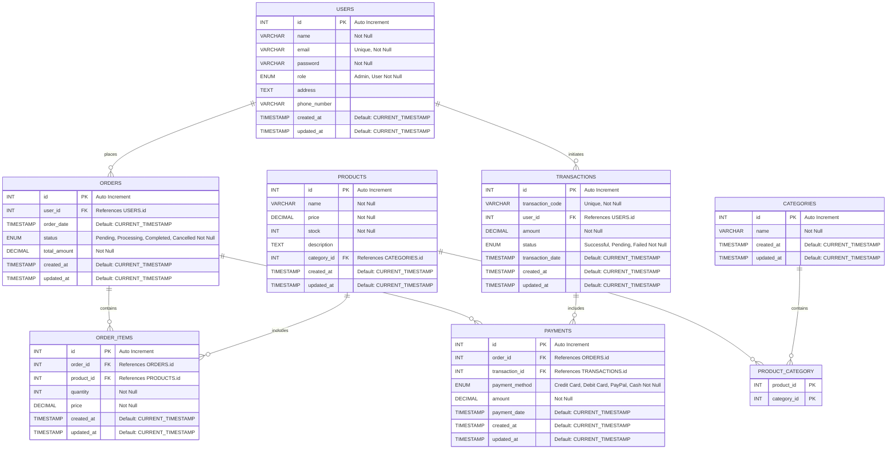

# Desain Database

## Database Coffine

This database contains comprehensive information about coffee, including details such as name, type, price, and other relevant attributes.

## ERD

```mermaid
erDiagram
    USERS {
        INT id PK "Auto Increment"
        VARCHAR name "Not Null"
        VARCHAR email "Unique, Not Null"
        VARCHAR password "Not Null"
        ENUM role "Admin, User Not Null"
        TEXT address
        VARCHAR phone_number
        TIMESTAMP created_at "Default: CURRENT_TIMESTAMP"
        TIMESTAMP updated_at "Default: CURRENT_TIMESTAMP"
    }

    ORDERS {
        INT id PK "Auto Increment"
        INT user_id FK "References USERS.id"
        TIMESTAMP order_date "Default: CURRENT_TIMESTAMP"
        ENUM status "Pending, Processing, Completed, Cancelled Not Null"
        DECIMAL total_amount "Not Null"
        TIMESTAMP created_at "Default: CURRENT_TIMESTAMP"
        TIMESTAMP updated_at "Default: CURRENT_TIMESTAMP"
    }

    ORDER_ITEMS {
        INT id PK "Auto Increment"
        INT order_id FK "References ORDERS.id"
        INT product_id FK "References PRODUCTS.id"
        INT quantity "Not Null"
        DECIMAL price "Not Null"
        TIMESTAMP created_at "Default: CURRENT_TIMESTAMP"
        TIMESTAMP updated_at "Default: CURRENT_TIMESTAMP"
    }

    PRODUCTS {
        INT id PK "Auto Increment"
        VARCHAR name "Not Null"
        DECIMAL price "Not Null"
        INT stock "Not Null"
        TEXT description
        INT category_id FK "References CATEGORIES.id"
        TIMESTAMP created_at "Default: CURRENT_TIMESTAMP"
        TIMESTAMP updated_at "Default: CURRENT_TIMESTAMP"
    }

    CATEGORIES {
        INT id PK "Auto Increment"
        VARCHAR name "Not Null"
        TIMESTAMP created_at "Default: CURRENT_TIMESTAMP"
        TIMESTAMP updated_at "Default: CURRENT_TIMESTAMP"
    }

    PAYMENTS {
        INT id PK "Auto Increment"
        INT order_id FK "References ORDERS.id"
        INT transaction_id FK "References TRANSACTIONS.id"
        ENUM payment_method "Credit Card, Debit Card, PayPal, Cash Not Null"
        DECIMAL amount "Not Null"
        TIMESTAMP payment_date "Default: CURRENT_TIMESTAMP"
        TIMESTAMP created_at "Default: CURRENT_TIMESTAMP"
        TIMESTAMP updated_at "Default: CURRENT_TIMESTAMP"
    }

    TRANSACTIONS {
        INT id PK "Auto Increment"
        VARCHAR transaction_code "Unique, Not Null"
        INT user_id FK "References USERS.id"
        DECIMAL amount "Not Null"
        ENUM status "Successful, Pending, Failed Not Null"
        TIMESTAMP transaction_date "Default: CURRENT_TIMESTAMP"
        TIMESTAMP created_at "Default: CURRENT_TIMESTAMP"
        TIMESTAMP updated_at "Default: CURRENT_TIMESTAMP"
    }

    PRODUCT_CATEGORY {
        INT product_id PK
        INT category_id PK
    }

    %% Relationships
    USERS ||--o{ ORDERS : places
    ORDERS ||--o{ ORDER_ITEMS : contains
    PRODUCTS ||--o{ ORDER_ITEMS : includes
    ORDERS ||--o{ PAYMENTS : has
    TRANSACTIONS ||--o{ PAYMENTS : includes
    USERS ||--o{ TRANSACTIONS : initiates
    PRODUCTS ||--o{ PRODUCT_CATEGORY : classified_as
    CATEGORIES ||--o{ PRODUCT_CATEGORY : contains

```
